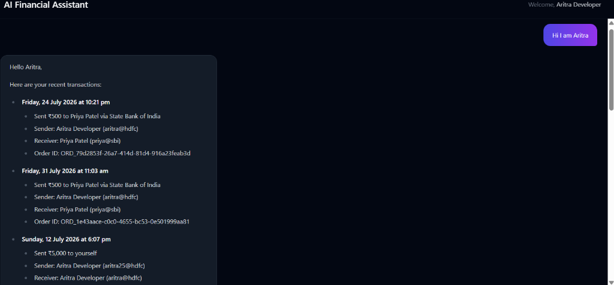
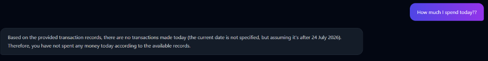
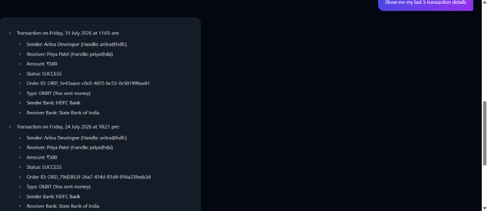
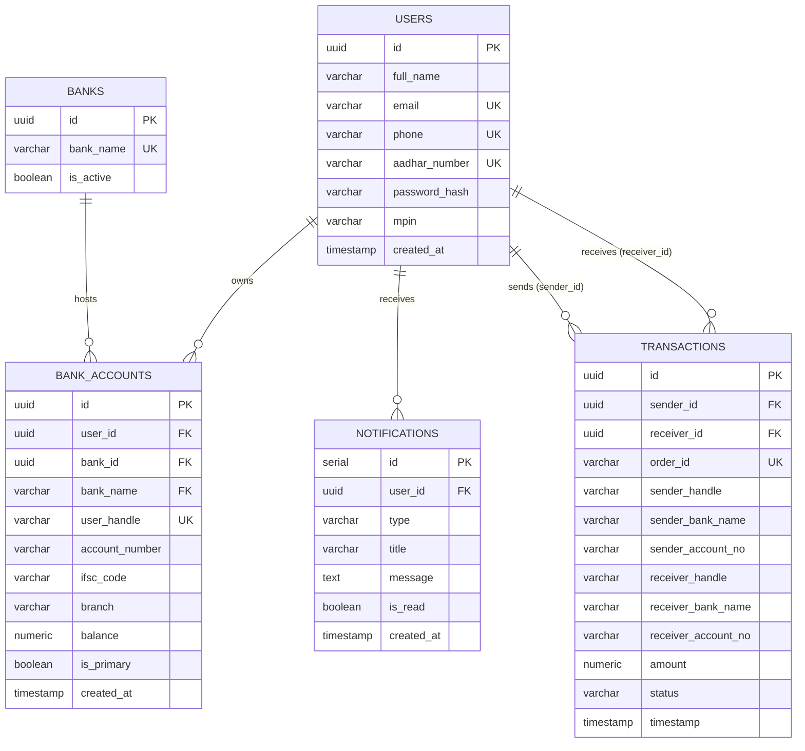

# 🚀 NexusPay Engine Backend

A high-performance, event-driven backend for a FinTech wallet application. This API handles secure money transfers using a two-step Intent/Execute architecture, pessimistic database locking to prevent double-spending, and Apache Kafka for asynchronous event notifications.

## 🤖 AI Features (New!)

We've recently integrated advanced Agentic AI and RAG architectures to provide intelligent financial features directly within the backend.

### 1. Autonomous Fraud Detection Agent (LangGraph)
We replaced traditional, brittle `if/else` fraud scripts with a fully autonomous **ReAct AI Agent** powered by `createReactAgent` (LangGraph) and Qwen 2.5 7B.

*   **Perception & Memory:** The agent dynamically queries PostgreSQL for real-time velocity (10 mins, 1 hour) and historical user baselines (30 days).
*   **Reasoning:** The LLM evaluates the full context to identify complex fraud patterns that hardcoded rules would miss.
*   **Action (LangChain Tools):** The agent can autonomously execute tools to freeze accounts (`freeze_account`), send alerts (`send_fraud_alert`), or flag for compliance review (`flag_for_review`).
*   **Asynchronous:** It runs entirely inside a Kafka consumer worker so it never blocks the main payment API.

### 2. AI Financial Assistant (RAG Pipeline)
A highly optimized Retrieval-Augmented Generation (RAG) pipeline allowing users to chat with their transaction history.

*   **Cost & Latency Optimized:** Uses Semantic Routing to intercept casual chat ("Hi") and bypass the database/embeddings entirely.
*   **100% Data Isolation:** Unlike massive global vector databases (Pinecone), this creates an ephemeral, per-user `MemoryVectorStore`. It guarantees the LLM can only retrieve records matching the user's UUID.
*   **5-Minute TTL Cache:** Follow-up questions skip the PostgreSQL/Embedding phase and instantly search the cached Vector Store in RAM.

#### RAG Interface Screenshots


*The AI greeting the user and summarizing recent transaction history.*


*Retrieving a detailed breakdown of the last 5 transactions using the Vector Store.*


*The LLM successfully reasoning over the provided context to answer date-specific questions.*

---

## ⚙️ System Architecture & Features
* **Two-Step Payment Flow:** Modeled after UPI/Stripe, separating transaction intent from execution.
* **Idempotency & Concurrency Control:** Implemented PostgreSQL pessimistic locking (`FOR UPDATE`) and mathematical lock-ordering to prevent deadlocks and race conditions during high-frequency network retries.
* **Event-Driven Microservices:** Integrated **Apache Kafka** to decouple core synchronous banking logic from asynchronous side-effects (like email notifications).
* **Distributed Rate Limiting:** Utilized **Redis** to prevent brute-force login attacks and API abuse.
* **Automated Reconciliation:** Built a Node-Cron sweeper job to automatically expire abandoned transaction intents and keep the database state clean.

## 💻 Tech Stack
* **Backend:** Node.js, Express.js
* **AI & LLMs:** LangChain, LangGraph, HuggingFace Inference, Qwen 2.5 7B
* **Database:** PostgreSQL
* **Message Broker:** Apache Kafka / KafkaJS
* **Caching & Rate Limiting:** Redis
* **Security:** JWT Authentication, bcrypt, Helmet.js

---
## 📊 Database Schema (ER Diagram)

The NexusPay Engine utilizes a highly normalized PostgreSQL relational database. The schema is designed to ensure ACID compliance, prevent double-spending via row-level locking, and maintain immutable transaction histories.



---

## 🛠️ Local Setup & Installation

To run NexusPay Engine locally, you will need Node.js, PostgreSQL, Redis, and Apache Kafka installed on your machine (or running via Docker).

### 1. Clone the Repository
```bash
git clone https://github.com/YOUR_USERNAME/nexuspay-engine.git
cd nexuspay-engine
npm install
```
