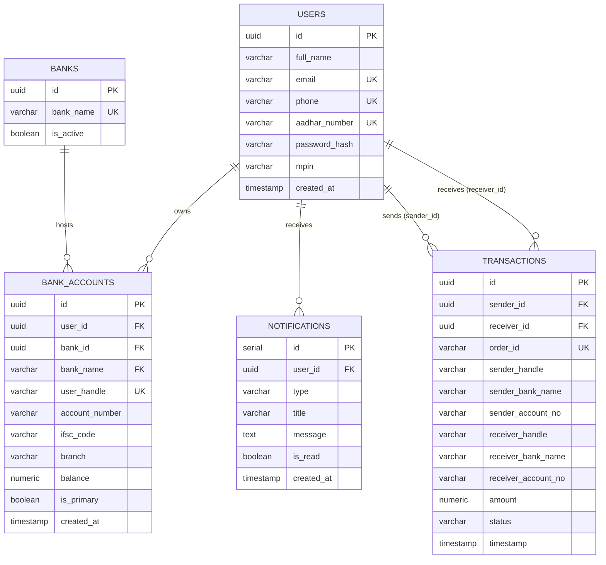

# 🏦 NexusPay Engine Backend


A high-performance, event-driven backend for a FinTech wallet application. This API handles secure money transfers using a two-step Intent/Execute architecture, pessimistic database locking to prevent double-spending, and Apache Kafka for asynchronous event notifications.

## 🚀 System Architecture & Features
* **Two-Step Payment Flow:** Modeled after UPI/Stripe, separating transaction intent from execution.
* **Idempotency & Concurrency Control:** Implemented PostgreSQL pessimistic locking (`FOR UPDATE`) and mathematical lock-ordering to prevent deadlocks and race conditions during high-frequency network retries.
* **Event-Driven Microservices:** Integrated **Apache Kafka** to decouple core synchronous banking logic from asynchronous side-effects (like email notifications).
* **Distributed Rate Limiting:** Utilized **Redis** to prevent brute-force login attacks and API abuse.
* **Automated Reconciliation:** Built a Node-Cron sweeper job to automatically expire abandoned transaction intents and keep the database state clean.

## 🛠️ Tech Stack
* **Backend:** Node.js, Express.js
* **Database:** PostgreSQL
* **Message Broker:** Apache Kafka / KafkaJS
* **Caching & Rate Limiting:** Redis
* **Security:** JWT Authentication, bcrypt, Helmet.js

---
## 📊 Database Schema (ER Diagram)

The NexusPay Engine utilizes a highly normalized PostgreSQL relational database. The schema is designed to ensure ACID compliance, prevent double-spending via row-level locking, and maintain immutable transaction histories.



---

## 💻 Local Setup & Installation

To run NexusPay Engine locally, you will need Node.js, PostgreSQL, Redis, and Apache Kafka installed on your machine (or running via Docker).

### 1. Clone the Repository
```bash
git clone [https://github.com/YOUR_USERNAME/nexuspay-engine.git](https://github.com/YOUR_USERNAME/nexuspay-engine.git)
cd nexuspay-engine
npm install
```
